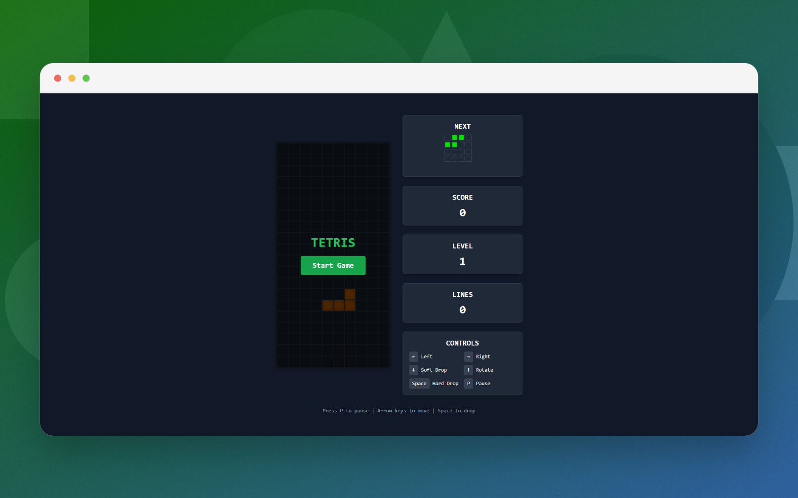

# Tetris Game

A simple Tetris game implemented in JavaScript, HTML, and CSS.  

## Screenshots



## Overview

This project is a browser-based version of the classic Tetris game. It demonstrates core JavaScript game development concepts, including game loops, collision detection, and DOM manipulation.

## How to Run

1. Clone or download this repository.
2. Open `index.html` in your web browser.

No additional setup or dependencies are required.

https://vinicius.is-a.dev/tetris/

## Project Structure

- `index.html` — Main HTML file. Loads the game and links the scripts and styles.
- `game.js` — Contains all the game logic, including rendering, controls, and game state management.
- `styles.css` — Styles for the game interface.

## Features

- Classic Tetris gameplay
- Keyboard controls for moving and rotating pieces
- Score tracking

## Controls

- **Left Arrow**: Move piece left
- **Right Arrow**: Move piece right
- **Up Arrow**: Rotate piece
- **Down Arrow**: Soft drop (move piece down faster)

## Licença

[](https://github.com/vncsmnl/tetris/blob/main/LICENSE)

```
            DO WHAT THE FUCK YOU WANT TO PUBLIC LICENSE
                    Version 2, December 2004

 Copyright (C) 2004 Sam Hocevar <sam@hocevar.net>

 Everyone is permitted to copy and distribute verbatim or modified
 copies of this license document, and changing it is allowed as long
 as the name is changed.

            DO WHAT THE FUCK YOU WANT TO PUBLIC LICENSE
   TERMS AND CONDITIONS FOR COPYING, DISTRIBUTION AND MODIFICATION

  0. You just DO WHAT THE FUCK YOU WANT TO.
```